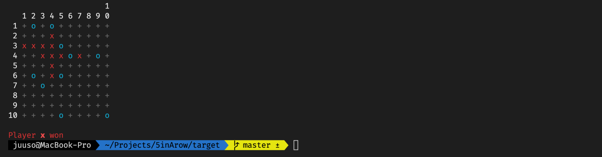

[](https://github.com/korhox/5inArow/releases/latest/download/5inArow.jar) 


[](https://korhox.github.io/5inArow/)

Welcome to my 5inArow game. This game is made with java and runs in command line. Graphical interface may be implemented in the future.



This game was made as final project work of "Introduction to Programming 2021" course by Jussi Pohjolainen ([@pohjus](https://github.com/pohjus)).

## Author
Juuso Korhonen

## Download
You can download the game from here: [download](https://github.com/korhox/5inArow/releases/latest/download/5inArow.jar)

## Running
To run the game, you'll need to have [Java](https://www.oracle.com/java/technologies/downloads/) installed.

Open console/terminal in the directory - where you downloaded the file to and execute a following command:
```java -jar ./5inArow.jar```

## Compiling the source code
Compiling requires Maven and Java Development Kit
1. Open terminal in the project folder (`cd xxx`)
2. Compile the code with command:
```bash
mvn clean install assembly:single
```
3. Run the compiled code with:
```bash
java -jar ./target/5inArow-1.0-jar-with-dependencies.jar
```

## Javadocs
Javadocs are available here: https://korhox.github.io/5inArow/

## Generating new javadoc for edited source
If you need to regenerate javadocs for you, I have convenitely configured in `pom.xml`
that the output woll go automatically to `/docs` on every time, you run `mvn install`.

## Project Work Requirements
Since this was a school project, it had a few requirements set by our course instructor. If you wonder some time, that why this was not used instead of this, it may be the reason. I also tried to use the coding practises we learned in the course.

Most standing out requirements were:
- Use 2D tables (Using Array classes, like ArrayList was prohibited)
- Game area must be dynamic, 3 to 20 range
- 10 or bigger game areas must have minimum of 5 streak to win
- Game must have a computer opponent and some kind of AI to make somewhat smart moves
- The game does not allow invalid inputs from the user(s)
- The project has javadocs